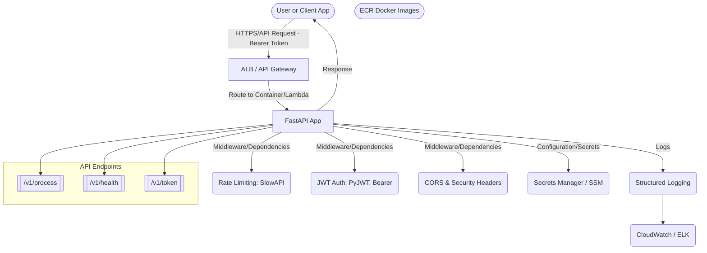

# boxbox
All burger and no bun

# FastAPI RESTful API Template

A Python 3 FastAPI REST API with full test coverage, logging, OpenAPI docs, and AWS-oriented deployment strategy.  
Endpoints: `/process` (POST), `/health`, `/version`.  

## Features
- JSON request/response via `/process`
- Health and version endpoints
- Logging (cloud-ready)
- Automatic OpenAPI docs (`/docs`)
- Unit tests (pytest)
- Deployment notes for AWS targets (Lambda, EKS, EC2)
- Dynamic acceptance criteria/worklist

## API Docs
Visit: http://localhost:8000/docs

## Installation & Setup

See `requirements.txt` for dependencies.

1. **Clone the repository**
    ```bash
    git clone git@github.com:Rushwind13/boxbox.git
    cd boxbox
    ```

2. **Python Virtual Environment**
    ```bash
    python3 -m venv venv
    source venv/bin/activate
    pip3 install --upgrade pip
    pip3 install -r requirements.txt
    ```

## Linting & Pre-Commit Hook
We use [pre-commit](https://pre-commit.com/) to enforce linting before every commit.
- Setup: `pip install pre-commit && pre-commit install`
- Now all `git commit`s will run `flake8` and block if not clean.

## How to Use:
Set environment variables for ENV (dev or prod), ALLOWED_ORIGINS, and JWT_SECRET.

In production, /docs, /openapi.json will be hidden, CORS will allow only listed origins, and JWT will be required for /process.

Obtain a JWT with a POST to /token, then use it as a Bearer token in Authorization header for /process.

## Run API Server
```bash
    uvicorn src.main:app --reload
 ```

## Run tests
 ```bash
    pytest
```

## Docker
```bash
    docker build -t processor .
    docker run -p 8000:8000 processor
```


## Deployment
See deployment/notes.md for AWS strategy options and cost/performance notes.

## Acceptance Criteria & Tasks
Maintained in ACCEPTANCE_CRITERIA.md

## System Architecture


